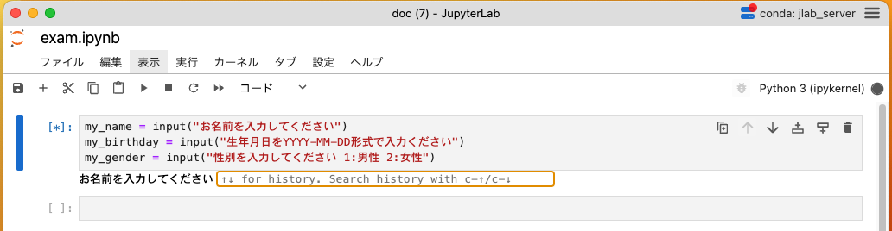

# PythonBasicB

## ファイルの取り扱い
```
//ファイルを開いて中身を読み取る
with open ("sample.txt","r",encoding="utf-8") as file:
    data = file.read()
    print(data)
```
| mode | 説明 | 例 |
| ---------------- | ---------------- | ---------------- |
| r | 読み込み |  |
| w | 書き込み(新規作成) |  |
| a | 追記 |  |
| r+ | 読み書き |　 | 
| w+ | 読み書き(新規作成) |　 | 
| a+ | 追記・読み書き |　 | 
| t | テキストモード |　 | 
| b | バイナリモード |　画像など | 

```
//ファイルを新規作成して、文字列を書き込んで保存
with open ("data.txt", "w", encoding="utf-8") as file:
    file.write("Python\n") #\nは改行を意味します
    file.write("保存")
```
- with 文を使用しない場合はclose()メソッドでファイルを閉じる必要があります。

## ディレクトリからファイルを取得する
globライブラリを使用する場合
```
import glob

files = glob.glob("./sample_dir/*")
print(files)
for file in files:
    print(file)
```

osライブラリを使用する場合
```
import os 

files = os.listdir("./sample_dir")
print(files)
for file in files:
    print(file)
```

練習問題：ファイルに保存する機能を使って、アプリケーションを永続化する

## 課題イメージ
